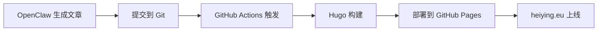

## 引言

现代博客管理可以完全自动化。结合 **OpenClaw AI 助手** + **Hugo** + **GitHub Pages** + **GitHub Actions**，可以实现从文章生成到部署的全自动流水线。

## 为什么选择这套方案？

| 工具 | 作用 | 优势 |
|------|------|------|
| **Hugo** | 静态站点生成 | 极速构建，主题丰富 |
| **GitHub Pages** | 托管 | 免费、HTTPS 自动证书 |
| **GitHub Actions** | CI/CD | 推送即自动构建部署 |
| **OpenClaw** | AI 写作助手 | 自动生成内容、维护、监控 |

## 自动化工作流



## OpenClaw 的核心能力

- ✅ **自动写作**：根据主题生成高质量 Markdown 文章
- ✅ **自动格式化**：Hugo front matter、标签、分类、描述
- ✅ **自动发布**：commit + push 触发 CI
- ✅ **监控维护**：heartbeat 检查构建状态、域名解析
- ✅ **多语言支持**：中英文自动切换

## 实战：一篇自动化生成的文章

本文就是由 OpenClaw 自动创建、格式化并提交的。流程：

1. OpenClaw 生成内容（含 front matter）
2. 保存到 `content/posts/YYYY/` 目录
3. `git add . && git commit -m "feat: new post"`
4. `git push origin main`
5. GitHub Actions 自动构建并更新 heiying.eu

无需手动操作。

## 技术要点

### Hugo 配置

```toml
baseURL = "https://heiying.eu"
theme = "papermod"
```

确保自定义域名生效。

### GitHub Pages 设置

在仓库 Settings → Pages 中：
- Source: GitHub Actions
- 已绑定自定义域名 heiying.eu

### GitHub Actions 工作流

使用 `peaceiris/actions-hugo` + `peaceiris/actions-gh-pages`。

关键配置：
```yaml
- uses: peaceiris/actions-hugo@v2
  with:
    hugo-version: 'latest'
    extended: true
```

## 未来优化方向

- 接入 AI 自动生成封面图
- RSS 自动摘要生成
- 多语言自动翻译
- SEO 自动优化（meta tags, sitemap）
- 评论系统集成（ utterances / giscus）
- 访问统计（Google Analytics / Umami）

## 结语

OpenClaw 让博客维护变得轻松。只需要告诉 AI 要写什么主题，剩下的交给自动化流水线。

欢迎访问 [heiying.eu](https://heiying.eu) 查看效果。
