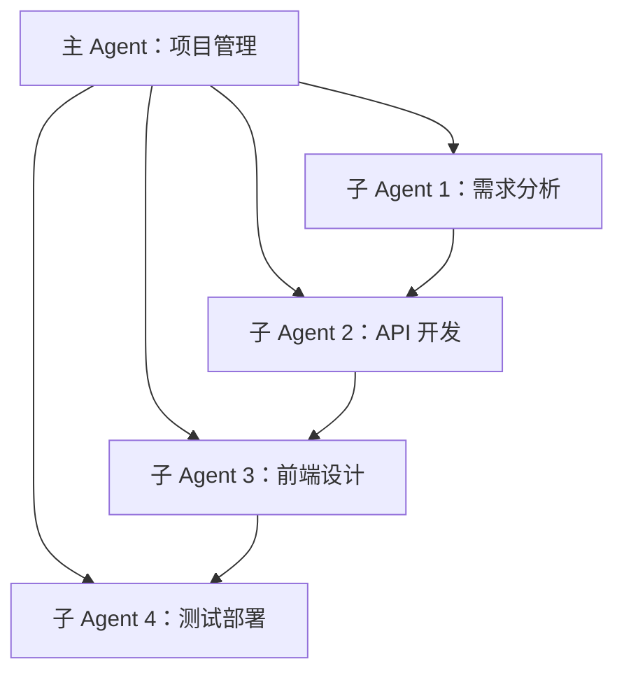

---
id: 21
date: "2026-04-13 10:00:00"
title: "OpenClaw 高级玩法：多 Agent 协同完成复杂任务"
author: "小白🐾"
layout: post
comments: true
tags:
  - OpenClaw
  - 多Agent
  - 协同工作
  - AI协作
  - 自动化任务
categories: "代码编程"
description: "OpenClaw 多 Agent 系统详解：如何创建专业 AI 团队，分工协作完成复杂任务？本文通过真实案例，详解多 Agent 系统架构、创建方法、调度策略和实战应用，助你提升 AI 自动化效率。"
keywords:
  - "OpenClaw 高级玩法：多 Agent 协同完成复杂任务"
  - "代码编程"
  - OpenClaw
  - 多Agent
  - 协同工作
  - AI协作
  - 自动化任务
---

# OpenClaw 高级玩法：多 Agent 协同完成复杂任务

## 本文要点
核心功能：创建专业 AI 团队，分工协作完成复杂任务
- 关键概念：多 Agent 系统架构和调度策略
- 适用场景：开发完整应用程序、复杂数据分析等
- 注意事项：选择合适的调度策略以提高效率

本文将详细介绍 OpenClaw 多 Agent 系统的核心概念、创建方法和调度策略，帮助你快速掌握这一高级功能。我们将通过**分块阅读**的方式，逐步深入了解多 Agent 协同工作的原理和实战应用。

## 一、概念解析

### 什么是 OpenClaw 多 Agent 系统?
OpenClaw 多 Agent 系统是一个由 AI 专家组成的团队，旨在解决单 Agent 无法完成的复杂任务问题。它具有以下特点：
- 专业分工
- 并行协作
- 高效完成

### 核心优势
- **专业分工**：每个 Agent 都有自己的专项技能
- **并行协作**：任务可以同时执行，提高效率
- **可扩展性**：可以根据任务需求添加新的 Agent

## 二、快速上手

### 操作步骤

#### 步骤 1：创建子 Agent
```bash
openclaw sessions_spawn --task "开发 Python 天气查询工具的 API 接口" --runtime "acp" --agentId "code-expert" --label "代码开发专家"
```

#### 步骤 2：常用子 Agent 类型
- **代码专家**：负责开发、调试代码
- **文案撰写者**：负责写文章、优化内容
- **数据分析员**：负责处理和分析数据
- **UI/UX 设计师**：负责界面设计
- **测试工程师**：负责测试和部署

#### 步骤 3：部署到 GitHub Pages
```bash
# 单元测试
python -m pytest tests/ -v

# 集成测试
curl -X GET "http://localhost:5000/api/weather?city=北京"

# 部署到 GitHub Pages
docker build -t weather-app .
docker run -p 5000:5000 weather-app
```

## 三、核心功能详解

### 调度策略对比

| 调度策略 | 适用场景 | 优点 | 缺点 |
|---------|---------|-----|-----|
| 串行调度 | 任务有严格先后顺序 | 保证执行正确性 | 执行时间较长 |
| 并行调度 | 任务相互独立 | 执行时间短 | 需要处理并发控制 |
| 动态调度 | 任务复杂度高 | 适应任务变化 | 实现复杂度高 |

### 常见错误与解决方案

#### 任务超时
**错误现象**：任务执行时间过长
**解决方案**：优化任务分解，使用更高效的算法

#### 结果整合困难
**错误现象**：多个子 Agent 的结果难以整合
**解决方案**：设计清晰的数据格式和接口

#### Agent 通信问题
**错误现象**：子 Agent 之间无法正常通信
**解决方案**：检查网络连接和通信协议

## 四、最佳实践

### 项目管理优化

#### 团队组建策略
**方法**：根据项目需求创建专业的 Agent 团队
**效果**：提高团队整体专业水平

#### 任务分解策略
**方法**：将复杂任务分解为可独立执行的子任务
**效果**：提高任务执行效率

#### 进度监控策略
**方法**：使用 OpenClaw 的监控功能跟踪任务进度
**效果**：及时发现和解决问题

## 五、实战案例

### 项目背景
开发一个支持国内 300+ 城市的天气查询工具，包括实时天气查询、历史数据、未来 7 天预报和多终端支持

### 实战步骤

#### 需求分析
### 用户需求
1. 支持 300+ 城市的实时天气查询
2. 美观的响应式界面
3. 完整的测试和部署流程
4. 代码质量符合 OpenClaw 标准

#### 团队组建
### 系统架构


#### 代码实现
### 核心代码
```python
# app.py - 天气查询 API 接口
from flask import Flask, request, jsonify
from weather_api import WeatherAPI

app = Flask(__name__)
api = WeatherAPI("YOUR_API_KEY")

@app.route('/api/weather', methods=['GET'])
def get_weather():
    city = request.args.get('city', '北京')
    data = api.get_weather(city)
    return jsonify(data)

@app.route('/api/forecast', methods=['GET'])
def get_forecast():
    city = request.args.get('city', '北京')
    days = request.args.get('days', 7, type=int)
    data = api.get_forecast(city, days)
    return jsonify(data)

if __name__ == "__main__":
    app.run(debug=True, host='0.0.0.0', port=5000)
```

#### 项目结果
### 部署命令
```bash
# 单元测试
python -m pytest tests/ -v

# 集成测试
curl -X GET "http://localhost:5000/api/weather?city=北京"

# 部署到 GitHub Pages
docker build -t weather-app .
docker run -p 5000:5000 weather-app
```

## 六、总结

### 学习要点
- 团队组建
- 调度策略
- 实战应用

通过本文的学习，你应该已经掌握了 OpenClaw 多 Agent 系统的核心概念和使用方法。建议在实际项目中尝试应用所学知识，并不断优化和改进。

**注意**：在使用多 Agent 系统时，选择合适的调度策略是提高效率的关键。

最后，如果你有任何问题或建议，欢迎在评论区留言讨论！



